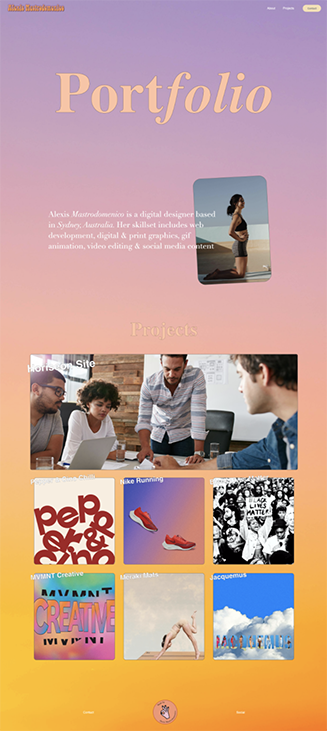

# Portfolio Website Build

## Description
* A portfolio page to showcase my skills & talents for future employers to view.

* The portfolio includes Contact links, about me section & projects section.

* I have created a flex-box section with the projects. I thought this was quite fidgety & didn't work at times - though I think I figured it out.

* 


## Installation
1. Clone the repository 
```bash
git clone git@github.com:LexMastro/AM-portfolio.git
```
2. Open `index.html` in web browser 
 

## Examples


## License 
This project is licensed under the [MIT License](LICENSE)
